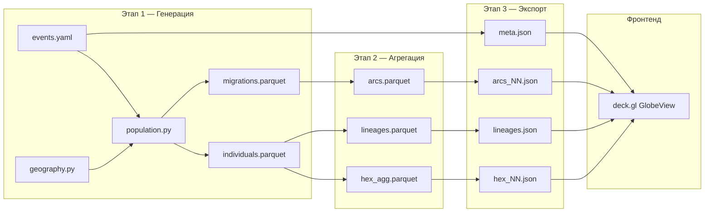
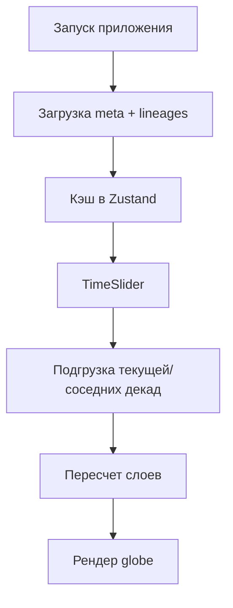

# Архитектура

Проект построен как трехэтапный конвейер:

1. **Генерация** синтетических данных  
2. **Агрегация** для визуализации  
3. **Экспорт** в статические тайлы для фронтенда

## Общий поток

## Бэкенд

### Два движка генерации

- `pipeline.local_generate` — локальный Python/NumPy/Parquet путь;
- `pipeline.spark_generate` — PySpark-путь для масштабирования.

Оба используют общие ядра генерации из `generator/spawn.py`, чтобы
результат был консистентным.

### Почему это масштабируется

Ключевая единица вычисления — когорта `(decade_idx, region_idx)`.
Когорты независимы, поэтому генерация почти «embarrassingly parallel»:
минимум shuffle и межпроцессных зависимостей.

### Агрегация

DuckDB + H3 extension:

- быстро считает плотности и топ-дуги;
- читает Parquet напрямую;
- не требует отдельного сервера.

## Фронтенд

Стек:

- React + TypeScript + Vite
- deck.gl (`GlobeView`, `H3HexagonLayer`, `ArcLayer`, `PathLayer`)
- Zustand (состояние)
- Tailwind + Framer Motion (UI/анимации)

Слои рендера:

1. контуры/заливка стран
2. H3-плотность населения
3. дуги миграций
4. родовые линии + endpoint-маркеры

## Поток данных в браузере

Тайлы загружаются лениво и кэшируются (`loader.dedupe`), чтобы не делать
повторных запросов.

## Причины выбора стека

- **PySpark**: горизонтальное масштабирование без переписывания логики.
- **DuckDB + H3**: быстрые OLAP-агрегации и геопривязка в SQL.
- **Parquet + партиции по декадам**: дешевые выборки по времени.
- **deck.gl**: GPU-рендер больших объемов геоданных.
- **Статические JSON-тайлы**: простой деплой (CDN/статический хостинг).
